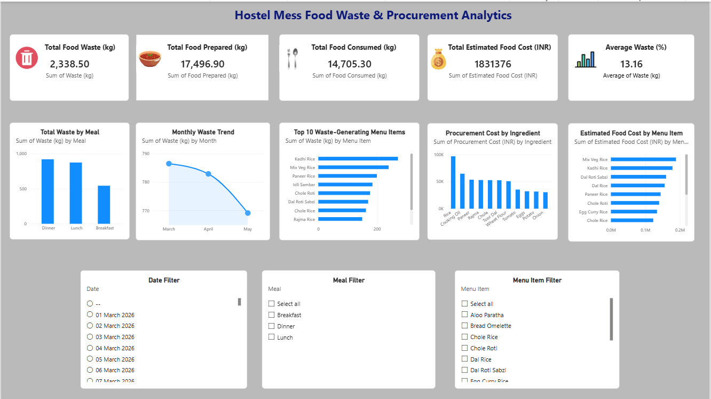

# Hostel Mess Food Waste & Procurement Analytics

## Project Overview

This project analyzes hostel mess operations to identify food waste patterns, food consumption trends, procurement costs, and high-waste menu items.

The project uses Excel, MySQL, SQL, and Power BI to perform data cleaning, analysis, visualization, and business insight generation.

## Business Objectives

- Analyze food prepared, consumed, leftover, and wasted.
- Identify meals generating the highest food waste.
- Identify high-waste menu items.
- Analyze monthly food waste trends.
- Analyze procurement costs by ingredient.
- Identify opportunities to reduce food waste and procurement costs.
- Build an interactive Power BI dashboard for decision-making.

## Tools & Technologies

- Microsoft Excel
- MySQL
- SQL
- Power BI
- GitHub

## Dataset

The project contains hostel mess operational and procurement data covering March to May 2026.

### Meal Operations

The dataset includes:

- Date
- Day
- Meal
- Menu Item
- Students Present
- Food Prepared (kg)
- Food Consumed (kg)
- Leftover (kg)
- Waste (kg)
- Waste %
- Estimated Food Cost (INR)
- Notes

### Procurement

The procurement dataset includes:

- Purchase Date
- Supplier
- Ingredient
- Category
- Quantity Purchased (kg)
- Unit Price (INR/kg)
- Procurement Cost (INR)
- Payment Status
- Delivery Rating

## Data Cleaning

The following data cleaning steps were performed:

- Removed duplicate meal-operation records.
- Handled missing student attendance data.
- Estimated missing food-cost values.
- Removed invalid blank/dummy SQL records.
- Validated food waste and waste percentage calculations.
- Verified dates and numeric fields after database import.

## SQL Analysis

MySQL and SQL were used for:

- Meal-wise waste analysis
- Average waste analysis
- Menu-level waste analysis
- High-waste menu identification
- Waste-category classification using CASE WHEN
- Monthly waste trend analysis
- Procurement cost analysis
- Supplier performance analysis
- Menu Master JOIN analysis
- Top waste-generating menu analysis

## Key KPIs

| KPI | Value |
|---|---:|
| Total Food Prepared | 17,496.90 kg |
| Total Food Consumed | 14,705.30 kg |
| Total Food Waste | 2,338.50 kg |
| Total Leftover | 2,791.60 kg |
| Average Waste | 13.16% |
| Total Estimated Food Cost | ₹1,831,376 |
| Estimated Waste Cost | ₹246,589.12 |

## Key Insights

### Waste by Meal

Dinner generated the highest total food waste at approximately 920.5 kg, followed by Lunch at 874.6 kg and Breakfast at 543.4 kg.

### High-Waste Menu Items

The highest total waste was observed for:

- Kadhi Rice
- Mix Veg Rice
- Paneer Rice
- Idli Sambar
- Chole Roti

### Waste Percentage

Menu items with high average waste percentages included:

- Paneer Rice
- Chole Rice
- Rajma Rice
- Poha
- Idli Sambar

### Monthly Trend

Total food waste decreased from March to May during the analyzed period.

### Procurement

Rice was the largest procurement-cost contributor, followed by Wheat and other major ingredients.

## Recommendations

1. Review dinner portion planning because dinner generates the highest total waste.
2. Reduce preparation quantities for consistently high-waste menu items.
3. Use historical attendance data to improve meal-level production planning.
4. Monitor menu items with consistently high waste percentages.
5. Optimize procurement quantities based on actual consumption patterns.
6. Review supplier performance and procurement costs regularly.
7. Use the Power BI dashboard for ongoing monitoring and decision-making.

## Power BI Dashboard

The interactive Power BI dashboard includes:

- Total Food Waste KPI
- Total Food Prepared KPI
- Total Food Consumed KPI
- Total Estimated Food Cost KPI
- Average Waste KPI
- Total Waste by Meal
- Monthly Waste Trend
- Top 10 Waste-Generating Menu Items
- Procurement Cost by Ingredient
- Estimated Food Cost by Menu Item
- Date Filter
- Meal Filter
- Menu Item Filter

## Project Workflow

Excel  
↓  
Data Cleaning  
↓  
MySQL  
↓  
SQL Analysis  
↓  
Power BI Dashboard  
↓  
Business Insights

## Project Outcome

This project demonstrates an end-to-end data analytics workflow for identifying food waste patterns, improving meal planning, and supporting procurement optimization.

## Author

**Brijesh Sahani**

Data Analytics Portfolio Project
